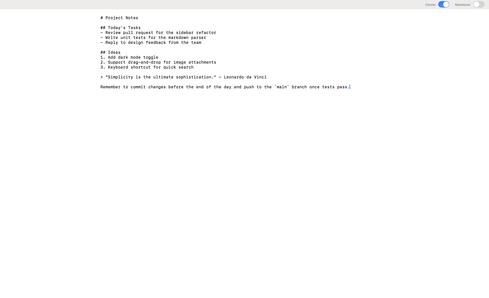

# Scratchpad

A minimal, distraction-free notepad for macOS. Built with plain AppKit — no
Xcode project, no dependencies, just Swift and system frameworks.

Scratchpad opens full-screen with a single text area. Your text is saved
automatically as you type, so there's nothing to name and nothing to save.
It's meant to stay open in its own Space as a permanent, always-available
scratchpad.



## Features

- **Autosave** — every keystroke is persisted immediately (via
  `UserDefaults`); close the app or restart your Mac and your text is right
  where you left it.
- **Markdown preview** — flip the "Markdown" switch to render the text as
  formatted output (headings, bold/italic, inline code, code blocks,
  blockquotes, ordered/unordered lists, links, and horizontal rules) using a
  custom lightweight Markdown renderer, no third-party libraries.
- **Centered / focus layout** — the "Center" switch constrains text to a
  fixed page width and centers it in the window, for a more comfortable
  reading and writing measure on wide screens.
- **Move lines with the keyboard** — `⌥↑` / `⌥↓` moves the current line up
  or down, like most modern code editors.
- **Bundled typography** — ships with IBM Plex Serif (regular, italic,
  bold, bold italic) for Markdown preview rendering, registered at launch
  so no system installation is required.
- **Launches full-screen** — opens maximized/full-screen by default to get
  out of your way immediately.
- **Tiny footprint** — a single-window AppKit app with no external
  dependencies, compiled directly with `swiftc`.

## Requirements

- macOS 15.0 or later
- Xcode Command Line Tools (for `swiftc`)

## Building

```bash
make build
```

This runs [`build.sh`](build.sh), which compiles the sources in `src/`
directly with `swiftc`, bundles the fonts from `Resources/Fonts`, and
produces `build/Scratchpad.app`.

## Installing

```bash
make install
```

Builds the app and copies it to `/Applications/Scratchpad.app`.

## Project structure

```
src/
  main.swift              # App entry point
  AppDelegate.swift        # Window, UI layout, and app lifecycle
  MarkdownRenderer.swift   # Custom Markdown → NSAttributedString renderer
  Fonts.swift              # Bundled font registration (IBM Plex Serif)
Resources/Fonts/           # Bundled .ttf font files
Info.plist                 # App bundle metadata
build.sh                   # Compiles and packages the .app bundle
Makefile                   # `make build` / `make install` targets
```

## License
Code released under the GNU GENERAL PUBLIC License.
