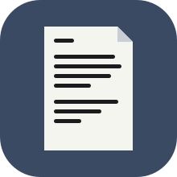

# Scratchpad

<p align="center">

</p>

A minimal, distraction-free notepad for macOS. Built with plain AppKit — no
Xcode project, no dependencies, just Swift and system frameworks.

Scratchpad opens full-screen with a single text area. Your text is saved
automatically as you type, so there's nothing to name and nothing to save.
It's meant to stay open in its own Space as a permanent, always-available
scratchpad.


## Features

- **Autosave** — every keystroke is persisted immediately (via
  `UserDefaults`); close the app or restart your Mac and your text is right
  where you left it.
- **Markdown preview** — flip the "Markdown" switch to render the text as
  formatted output (headings, bold/italic, inline code, code blocks,
  blockquotes, ordered/unordered lists, links, and horizontal rules) using a
  custom lightweight Markdown renderer, no third-party libraries.
- **Centered / focus layout** — the "Center" switch constrains text to a
  fixed page width and centers it in the window, for a more comfortable
  reading and writing measure on wide screens.
- **Move lines with the keyboard** — `⌥↑` / `⌥↓` moves the current line up
  or down, like most modern code editors.
- **Bundled typography** — ships with IBM Plex Serif (regular, italic,
  bold, bold italic) for Markdown preview rendering, registered at launch
  so no system installation is required.
- **Adjustable font size** — `Scratchpad ▸ Settings…` (`⌘,`) opens a settings
  window with a slider that changes the text size (10–32 pt) live, for the
  editor, the Markdown preview and LLM answers; the choice is remembered
  between launches.
- **LLM Responds panel** — `View ▸ Show LLM Responds` (`⇧⌘L`) opens a panel on
  the left where you write a prompt about your note. It isn't a chat: each
  time you ask, the prompt is sent together with the note as it is right
  now, and the new answer replaces the previous one. See
  [LLM Responds](#llm-responds).
- **Launches full-screen** — opens maximized/full-screen by default to get
  out of your way immediately.
- **Tiny footprint** — a single-window AppKit app with no external
  dependencies, compiled directly with `swiftc`.

## LLM Responds

A side panel that answers the same question about your note whenever you ask,
for example *"What's still unresolved in these notes?"* or *"Summarize this in
three bullet points"*.

1. Open it with `View ▸ Show LLM Responds` (`⇧⌘L`).
2. The first time, fill in the connection (the gear button in the panel's
   header shows or hides it):
   - **Endpoint** — the base URL of any OpenAI-compatible Chat Completions
     API, e.g. `https://api.openai.com/v1`, or a local server such as Ollama
     (`http://localhost:11434/v1`) or LM Studio (`http://localhost:1234/v1`).
     A full `…/chat/completions` URL works too.
   - **API key** — sent as a bearer token; leave it empty for local servers
     that don't need one. It is stored in your login Keychain, not in the
     app's preferences.
   - **Model** — the model name the server expects.
3. Write your prompt and press `Return` (`⇧↩` adds a line break).
4. Keep writing. Whenever you want a fresh answer about the current text, press
   `⌘↩` (`View ▸ Get Response`) from anywhere, even while typing in the
   editor. `⌘.` stops an answer in progress.

Each request contains only a short system prompt, your note and your prompt;
there is no conversation history. Answers stream in and are rendered as
Markdown. The prompt, the last answer and the connection settings are
remembered between launches.

Plain `http://` endpoints are only allowed for local servers (such as
`localhost` or `.local` hosts); anything else must use `https://`.

## Requirements

- macOS 15.0 or later
- Xcode Command Line Tools (for `swiftc`)

## Building

```bash
make build
```

This runs [`build.sh`](build.sh), which compiles the sources in `src/`
directly with `swiftc`, bundles the fonts from `Resources/Fonts`, and
produces `build/Scratchpad.app`.

## Installing

```bash
make install
```

Builds the app and copies it to `/Applications/Scratchpad.app`.

## Project structure

```
src/
  main.swift              # App entry point
  AppDelegate.swift        # Window, UI layout, and app lifecycle
  MarkdownRenderer.swift   # Custom Markdown → NSAttributedString renderer
  Fonts.swift              # Bundled font registration (IBM Plex Serif)
  SettingsWindowController.swift  # Settings window (font size slider)
  LLMRespondsView.swift    # LLM Responds side panel (prompt, answer, connection)
  LLMClient.swift          # OpenAI-compatible Chat Completions client (streaming)
  Keychain.swift           # Keychain storage for the API key
Resources/Fonts/           # Bundled .ttf font files
Resources/Icon/            # Source app icon
Info.plist                 # App bundle metadata
build.sh                   # Compiles and packages the .app bundle
Makefile                   # `make build` / `make install` targets
```

## License
Code released under the GNU GENERAL PUBLIC License.
